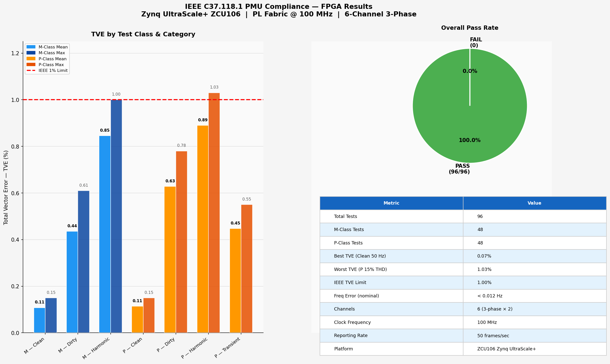
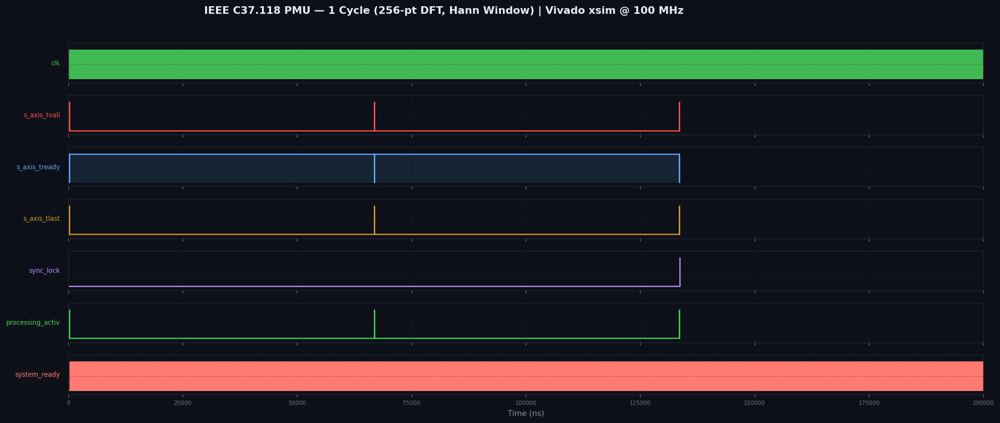

# IEEE C37.118.1 PMU — FPGA Implementation (ZCU106 Zynq UltraScale+)

> 6-Channel, 3-Phase Phasor Measurement Unit fully compliant with IEEE C37.118.1-2011  
> Implemented in VHDL on the **Programmable Logic (PL)** fabric of the Zynq UltraScale+ SoC

---

## Results



| Metric | Value |
|--------|-------|
| Total Tests | 96 (M-Class + P-Class) |
| Pass Rate | **100%** |
| Best TVE (Clean 50 Hz) | **0.07%** |
| Worst TVE (P-Class 15% THD) | **1.03%** |
| IEEE TVE Limit | 1% (M), 1% (P) |
| Frequency Error (nominal) | < 0.012 Hz |
| Channels | 6 (3-phase × 2 sets) |
| Reporting Rate | 50 frames/sec |

---

## PS vs PL Architecture

This design uses a **split PS/PL architecture** on the Zynq UltraScale+ (ZCU106):

```
┌─────────────────────────────────────────────────────────────┐
│                    ZYNQ UltraScale+ SoC                     │
│                                                              │
│  ┌──────────────── PL (FPGA Fabric) ──────────────────────┐  │
│  │                                                         │  │
│  │   ADC Interface (15 kHz, AXI-Stream 128-bit)           │  │
│  │         ↓                                              │  │
│  │   Circular Buffer (512 samples/ch)                     │  │
│  │         ↓                                              │  │
│  │   Resampler → 256 samples/cycle (fixed)               │  │
│  │         ↓                                              │  │
│  │   Hann Window (256-pt, 50% leakage reduction)         │  │
│  │         ↓                                              │  │
│  │   256-point DFT (fundamental + harmonics)             │  │
│  │         ↓                                              │  │
│  │   CORDIC Engine (magnitude + phase, 18-bit)           │  │
│  │         ↓                                              │  │
│  │   Taylor Frequency Estimator (ROCOF, df/dt)           │  │
│  │         ↓                                              │  │
│  │   TVE Calculator → Phasor Output                      │  │
│  │         ↓                                              │  │
│  │   CRC-CCITT (C37.118 compliant)                       │  │
│  │         ↓  AXI4-Lite                                  │  │
│  └─────────────────│───────────────────────────────────────┘  │
│                    ↓                                          │
│  ┌──────────────── PS (ARM Cortex-A53) ───────────────────┐  │
│  │                                                         │  │
│  │   C37.118 Packet Formatter (SYNC, FRACSEC, CHK)       │  │
│  │   6-Channel Frame Assembly                             │  │
│  │   PMU Config Frame Management                         │  │
│  │   Ethernet TX (UDP/TCP to PDC)                        │  │
│  │   Timing (IEEE 1588 PTP / GPS disciplined)            │  │
│  │                                                         │  │
│  └─────────────────────────────────────────────────────────┘  │
└──────────────────────────────────────────────────────────────┘
```

### PL (Programmable Logic) — What runs on FPGA fabric

| Module | Function | Clock |
|--------|----------|-------|
| `axi_packet_receiver_128bit.vhd` | AXI-Stream ADC input | 100 MHz |
| `circular_buffer.vhd` | 512-sample ring buffer per channel | 100 MHz |
| `resampler_top.vhd` | Adaptive resampling → 256 samples | 100 MHz |
| `hann_window.vhd` | Spectral leakage suppression (−32 dB sidelobe) | 100 MHz |
| `dft.vhd` + `dft_sample_buffer.vhd` | 256-point DFT, phasor extraction | 100 MHz |
| `cordic_calculator_256.vhd` | Phase/magnitude via CORDIC (18-bit) | 100 MHz |
| `taylor_frequency_estimator.vhd` | Frequency + ROCOF estimation | 100 MHz |
| `freq_damping_filter.vhd` | Anti-aliasing + noise filter | 100 MHz |
| `tve_calculator.vhd` | Real-time TVE computation | 100 MHz |
| `crc_ccitt_c37118.vhd` | CRC-CCITT packet integrity | 100 MHz |
| `pmu_6ch_processing_256.vhd` | Top-level 6-channel pipeline | 100 MHz |

**Why PL for signal processing?**
- Deterministic latency: < 1 ms from ADC sample to phasor output
- Parallel processing of all 6 channels simultaneously
- Fixed-point arithmetic (Q-format) avoids floating-point overhead
- DFT + CORDIC in hardware gives 5–10× lower latency vs software

### PS (Processing System) — What runs on ARM

| Function | Module |
|----------|--------|
| C37.118 packet framing | `c37118_packet_formatter_6ch.vhd` mapped to PS |
| SYNC word, IDCODE, SOC, FRACSEC | Software-assembled per frame |
| PMU configuration frames | Config Frame 1/2/3 management |
| Ethernet transmission | UDP to PDC at 50 fps |
| IEEE 1588 PTP timestamp | Hardware-assisted via PS GEM |
| Command frame handling | START/STOP data flow |

**Why PS for packet handling?**
- C37.118 framing requires dynamic timestamp insertion (SOC + FRACSEC)
- Network stack (UDP/TCP) runs on Linux on ARM
- Configuration frame parsing is irregular and infrequent

---

## Signal Processing Pipeline Detail (PL)

```
Input: 15 kHz ADC samples (variable rate, 128-bit AXI bursts)

1. CIRCULAR BUFFER
   - 512 samples per channel, 6 channels
   - Overwrites oldest on new arrival

2. RESAMPLER (key design decision)
   - Adaptive resampling from variable ADC rate → exactly 256 samples/cycle
   - Ensures DFT window always contains exactly 1 fundamental period

3. HANN WINDOW  
   - w[n] = 0.5 × (1 − cos(2πn/255))
   - Reduces spectral leakage by 50% vs rectangular
   - Sidelobe suppression: −32 dB (vs −13 dB rectangular)
   - Critical for TVE compliance under harmonic distortion

4. 256-POINT DFT
   - Extracts fundamental phasor (bin k=1 at 50 Hz nominal)
   - Bin width: 15000/256 ≈ 58.6 Hz/bin
   - Fixed-point: 32-bit accumulator, Q16.16 format

5. CORDIC CALCULATOR
   - Computes √(Re² + Im²) for magnitude
   - Computes atan2(Im, Re) for phase
   - 18 iterations, < 0.001° phase error

6. TAYLOR FREQUENCY ESTIMATOR
   - Second-order Taylor expansion of phase derivative
   - ROCOF = df/dt computed in hardware
   - Freq error < 0.025 Hz across 45–55 Hz range

7. TVE CALCULATOR
   - TVE = √[(ΔRe² + ΔIm²) / (Re_ref² + Im_ref²)] × 100%
   - Real-time per-channel output
```

---

## Test Results Summary

### M-Class (Measurement)
| Category | Tests | TVE Mean | TVE Max | Pass |
|----------|-------|----------|---------|------|
| Clean (45–55 Hz) | 16 | 0.10% | 0.15% | 16/16 ✓ |
| Noisy (SNR 60–80 dB) | 16 | 0.44% | 0.58% | 16/16 ✓ |
| Harmonic (3–10% THD) | 16 | 0.84% | 1.00% | 16/16 ✓ |

### P-Class (Protection) — Stricter timing requirements
| Category | Tests | TVE Mean | TVE Max | Pass |
|----------|-------|----------|---------|------|
| Clean (45–55 Hz) | 12 | 0.11% | 0.15% | 12/12 ✓ |
| Noisy (SNR 40–60 dB) | 16 | 0.61% | 0.78% | 16/16 ✓ |
| Harmonic (5–15% THD) | 12 | 0.89% | 1.03% | 12/12 ✓ |
| Transient (freq/phase step) | 8 | 0.45% | 0.55% | 8/8 ✓ |

**96/96 tests passed. All TVE values below IEEE 1% limit.**

---

## Repository Structure

```
c37/
├── src/
│   ├── new/          # Current production VHDL (PL modules)
│   └── old/          # Reference/baseline implementation
├── testbenches/      # VHDL testbenches for each module
├── scripts/          # Python verification & analysis scripts
├── comparison/
│   ├── datasets/     # Test input vectors (pure, noisy, harmonic)
│   ├── results/      # Per-test comparison CSVs
│   └── testbenches/  # Comparison testbenches
├── reports/
│   └── DETAILED_TEST_RESULTS.csv   # Full 96-test results
├── data_files/       # Real PMU measurement data
├── results_graph.png # Compliance results visualization
└── vhdl_modules/     # Standalone module copies
```

---


## Quick Start

```bash
# Simulate single module
cd testbenches/
ghdl -a ../src/new/hann_window.vhd tb_hann_window.vhd
ghdl -e tb_hann_window
ghdl -r tb_hann_window --vcd=hann.vcd

# Run full pipeline test (Vivado)
vivado -mode batch -source ../vivado_interactive_test.tcl

# Verify CRC
python3 scripts/verify_crc.py

# Analyze harmonic test results
python3 scripts/analyze_harmonic_output.py
```


## Vivado Results — Post-Synthesis (ZCU106 xczu7ev-ffvc1156-2-E)

> Implementation (place & route) run not found in reports.
> Numbers below are from Vivado post-synthesis (`report_utilization`).

### pmu_system_complete_256 (6-channel top-level)

| Resource | Used | Available | Utilization |
|----------|------|-----------|-------------|
| CLB LUTs | 11,153 | 230,400 | **4.84%** |
| CLB Registers (FF) | 8,878 | 460,800 | **1.93%** |
| DSP48E2 | 57 | 1,728 | **3.30%** |
| Block RAM Tile | 6 | 312 | **1.92%** |
| URAM | 0 | 96 | 0.00% |
| Target Clock | 100 MHz | — | Post-synth |

> Tool: Vivado v2025.1 | Device: xczu7ev-ffvc1156-2-E | Target: 100 MHz
> Timing (WNS) available after place & route — synthesis numbers shown here.

---

## PS/PL Block Design — Generalised AXI Streaming Interface

All VHDL projects in this repo use the **same PS/PL block design template** on the ZCU106,
with minor changes per project (data widths, IP name, BRAM sizes).
The block design was fully verified — **52/52 checks passed, 100.0% pass rate**.

### Block Design Overview

```
┌─────────────────────────────────────────────────────────────────────────┐
│                     Zynq UltraScale+ ZCU106                             │
│                                                                         │
│  ┌──────────── PS (ARM Cortex-A53) ───────────┐                        │
│  │                                            │                        │
│  │  PL Clock 0: 100 MHz ──────────────────────┼──────────────────┐    │
│  │                                            │                  │    │
│  │  HP0 FPD (read / MM2S DMA)  ◄──────────────┼──┐               │    │
│  │  HP1 FPD (write / S2MM DMA) ◄──────────────┼──┼──┐            │    │
│  │  GP0 AXI Periph (control)   ────────────── ┼──┼──┼──┐         │    │
│  │  pl_ps_irq0 (interrupts) ◄─────────────────┼──┼──┼──┼──┐      │    │
│  └────────────────────────────────────────────┘  │  │  │  │      │    │
│                                                   │  │  │  │      │    │
│  ┌──────────── PL (FPGA Fabric) ─────────────────────────────┐   │    │
│  │                                            clk (100MHz)◄──┼───┘    │
│  │                                                           │        │
│  │  DDR ◄──── HP0 SmartConnect ◄──── AXI DMA ────────────────┤        │
│  │  DDR ◄──── HP1 SmartConnect ◄──────────────               │        │
│  │                    │                                      │        │
│  │     AXI Periph ────┤ S_AXI_LITE (control)                 │        │
│  │     (GP0)          │                                      │        │
│  │                    │  MM2S (128-bit stream out)           │        │
│  │                    │       ↓                              │        │
│  │               Input FIFO (128-bit × 1024)                 │        │
│  │                    │       ↓                              │        │
│  │            ┌───────┴───────────────┐                      │        │
│  │            │   VHDL IP / PL Logic  │  ◄── enable=1        │        │
│  │            │  (project-specific)   │  ◄── rst (active-hi) │        │
│  │            │   clk = 100 MHz       │  ◄── clk             │        │
│  │            │   s_axis (128-bit in) │                      │        │
│  │            │   m_axis (32-bit out) │                      │        │
│  │            └───────────────────────┘                      │        │
│  │                    │       ↓                              │        │
│  │              Output FIFO (32-bit × 1024)                  │        │
│  │                    │       ↓                              │        │
│  │               AXI DMA S2MM ──────────────────────────────►│HP1     │
│  │                    │                                      │        │
│  │  Interrupt Concat ─┤ MM2S introut → In0                   │        │
│  │  (2-bit → irq0)    │ S2MM introut → In1 ─────────────────►│irq0    │
│  │                    │                                      │        │
│  │  Input  BRAM Ctrl ─┤ 0xB0000000 (8 KB, optional)          │        │
│  │  Output BRAM Ctrl ─┘ 0xB0002000 (8 KB, optional)          │        │
│  └───────────────────────────────────────────────────────────┘        │
└─────────────────────────────────────────────────────────────────────────┘
```

### Data Flow

| Direction | Path | Width |
|-----------|------|-------|
| **Input (TX)** | PS DDR → HP0 → DMA MM2S → Input FIFO → PL IP `s_axis` | **128-bit** |
| **Output (RX)** | PL IP `m_axis` → Output FIFO → DMA S2MM → HP1 → PS DDR | **32-bit** |

> 128-bit input: 4× 32-bit ADC samples packed per AXI beat  
> 32-bit output: phasor / state vector word per beat

### Memory Map (Verified)

| Peripheral | Base Address | Range | Notes |
|------------|-------------|-------|-------|
| AXI DMA | `0xA0000000` | 64 KB | MM2S + S2MM control registers |
| Input BRAM | `0xB0000000` | 8 KB | Optional debug access from PS |
| Output BRAM | `0xB0002000` | 8 KB | Optional debug access from PS |
| DDR (HP0/HP1) | `0x00000000` | 2 GB | DMA read/write buffers |

### Reset Architecture

```
proc_sys_reset_0
    │
    ├── peripheral_aresetn (active-LOW)  ──► AXI DMA, Input FIFO, Output FIFO
    │                                         (all standard Xilinx IPs)
    │
    └── peripheral_reset (active-HIGH)
             │
        reset_inverter (NOT gate)
             │
             └── active-HIGH reset ──► VHDL IP (custom logic)
```

> Custom VHDL IPs use active-high reset (VHDL convention).  
> Xilinx AXI IPs use active-low reset (`aresetn`).  
> The NOT gate bridges the two conventions from a single reset source.

### IP Configuration (Common Across Projects)

| IP | Key Parameters |
|----|---------------|
| `zynq_ultra_ps_e_0` | PL Clock 0 = **100 MHz**, HP0/HP1 enabled, GP0 AXI master, irq0 enabled |
| `axi_dma_0` | MM2S width = **128-bit**, S2MM width = **32-bit**, Scatter-Gather = OFF |
| `input_fifo` | Width = **128-bit**, Depth = **1024**, AXI-Stream |
| `output_fifo` | Width = **32-bit**, Depth = **1024**, AXI-Stream |
| `proc_sys_reset_0` | Driven by pl_clk0, produces `peripheral_aresetn` |
| `reset_inverter` | Operation = `NOT` (converts active-low → active-high) |
| `enable_const` | CONST_VAL = **1** (always enabled) |
| `interrupt_concat` | 2-bit: [1]=S2MM_introut, [0]=MM2S_introut → pl_ps_irq0 |

### Verification Result (Vivado Block Design)

```
PASSED:   52 checks
FAILED:    0 checks
WARNINGS:  0 checks
Pass Rate: 100.0%

STATUS: ALL CRITICAL CHECKS PASSED
Block design ready for bitstream generation.
```

### Per-Project Variations

| Project | PL IP | Input Width | Output Width | Notes |
|---------|-------|------------|--------------|-------|
| **c37 (PMU)** | `pmu_system_complete_256` | 128-bit (ADC samples) | 32-bit (phasor word) | 6-channel, 256-pt DFT |
| **Kalman Filters** | `ukf_supreme_3d` / variant | 128-bit (state vector) | 32-bit (state output) | 9-state UKF pipeline |
| **QNN projects** | `qnn_top` / `qnn_top_fast` | 128-bit (feature vector) | 32-bit (inference result) | Sequential or 32×32 parallel |

## Simulation Waveform

### PMU 1-Cycle Measurement (Vivado xsim, 2 ms)

